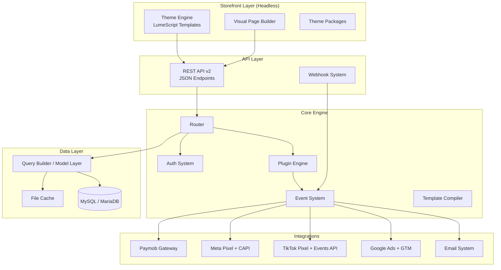
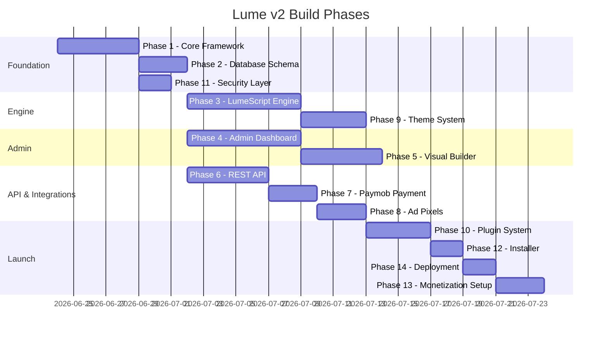

# 🌟 Lume v2 — Master Implementation Plan
## Headless E-Commerce CMS Platform (Complete Rebuild from Zero)

> **Goal**: Rebuild Lume from scratch as a headless, modular, open-source e-commerce CMS that rivals Shopify in customizability, runs on Hostinger Business hosting (PHP 8.2+ / MySQL), and is profitable through a marketplace + premium features model.

---

## Current State Analysis (Lume v1)

The existing [Lume-PHP-System](https://github.com/Ahmedtamer-1/Lume-PHP-System-) has:

| Aspect | Current (v1) | Problem |
|--------|-------------|---------|
| Architecture | Procedural PHP, file-based routing | No separation of concerns, tightly coupled |
| Frontend | Hardcoded HTML in PHP files | No theming, no customization without code |
| Admin | 15+ admin pages with inline CSS/JS | Buggy UI, not minimal/clean |
| Database | 10+ migrations scattered as SQL files | No migration system, fragile schema |
| Templating | None — raw PHP echo | Can't swap themes, no builder possible |
| API | Mixed `/api/` endpoints + v1 REST attempt | Inconsistent, no authentication layer |
| Payments | Paymob integration exists but fragile | Hardcoded, no multi-gateway support |
| Ad Pixels | Not implemented | Missing entirely |
| Plugins | None | Zero extensibility |
| Security | Basic session auth, some CSRF | No rate limiting, no input sanitization standard |

> [!CAUTION]
> **The v1 codebase cannot be incrementally improved** — its architecture fundamentally prevents theming, plugins, and a visual builder. A clean rebuild is required.

---

## Architecture Overview



---

## Tech Stack & Hostinger Constraints

| Component | Choice | Reason |
|-----------|--------|--------|
| **Language** | PHP 8.2+ | Hostinger Business supports 8.2, native performance |
| **Database** | MySQL 8.0 / MariaDB 10.6 | Hostinger default, JSON column support |
| **Frontend Admin** | Vanilla JS + CSS (no framework) | Zero build step, instant load |
| **Templating** | Custom "LumeScript" engine | Sandboxed, Liquid-inspired but more powerful |
| **Cache** | File-based (APCu if available) | No Redis on shared hosting |
| **Email** | PHPMailer (bundled) | No Composer on shared hosting |
| **HTTP** | Native cURL | Available on all Hostinger plans |
| **Session** | PHP native sessions + DB tokens for API | Standard, secure |
| **Package Manager** | None required (self-contained) | Must work without Composer/npm on server |

> [!IMPORTANT]
> **Hostinger Business Plan Constraints**:
> - No SSH on basic plans (available on Business)
> - No Redis/Memcached (file cache only)
> - PHP extensions: PDO, cURL, GD, mbstring, openssl ✅
> - Upload limit: typically 256MB (configurable via .htaccess)
> - Cron jobs: ✅ Available via hPanel
> - No root access — everything must work within `public_html`

---

## Phase 1: Core Foundation

> **AI Prompt for Phase 1**: *"Build the core PHP framework foundation for Lume v2 — a headless e-commerce CMS. Create the directory structure, autoloader, router, configuration system, database abstraction layer, migration system, and base model classes. Everything must run on PHP 8.2+ with MySQL, no Composer, no external dependencies except bundled PHPMailer. Use PSR-4-style autoloading via a custom spl_autoload_register."*

### 1.1 Directory Structure

```
lume/
├── .htaccess                    # URL rewriting, security headers
├── index.php                    # Single entry point (front controller)
├── install.php                  # First-run installer wizard
│
├── app/                         # Application core
│   ├── Core/                    # Framework core classes
│   │   ├── App.php              # Application bootstrap
│   │   ├── Router.php           # URL router with middleware support
│   │   ├── Request.php          # HTTP request wrapper
│   │   ├── Response.php         # HTTP response (JSON, HTML, redirect)
│   │   ├── Controller.php       # Base controller class
│   │   ├── Middleware.php       # Middleware interface
│   │   ├── Config.php           # Configuration loader (env + db)
│   │   ├── Cache.php            # File-based cache system
│   │   ├── Logger.php           # File-based logging
│   │   └── Container.php        # Simple DI container
│   │
│   ├── Database/                # Database layer
│   │   ├── Connection.php       # PDO connection manager (singleton)
│   │   ├── QueryBuilder.php     # Fluent query builder
│   │   ├── Model.php            # Base model with CRUD + relations
│   │   ├── Migration.php        # Migration runner
│   │   └── Schema.php           # Schema builder for migrations
│   │
│   ├── Auth/                    # Authentication
│   │   ├── AuthManager.php      # Session + token auth
│   │   ├── Guard.php            # Authorization guards (admin, api, customer)
│   │   └── Middleware/
│   │       ├── AuthMiddleware.php
│   │       ├── AdminMiddleware.php
│   │       ├── ApiTokenMiddleware.php
│   │       ├── CsrfMiddleware.php
│   │       └── RateLimitMiddleware.php
│   │
│   ├── Models/                  # Data models
│   │   ├── User.php
│   │   ├── Product.php
│   │   ├── ProductVariant.php
│   │   ├── Category.php
│   │   ├── Order.php
│   │   ├── OrderItem.php
│   │   ├── Cart.php
│   │   ├── Page.php
│   │   ├── Media.php
│   │   ├── Setting.php
│   │   ├── Theme.php
│   │   ├── Section.php
│   │   ├── Plugin.php
│   │   ├── Subscriber.php
│   │   ├── ShippingZone.php
│   │   ├── Coupon.php
│   │   └── ActivityLog.php
│   │
│   ├── Controllers/
│   │   ├── Admin/               # Admin panel controllers
│   │   │   ├── DashboardController.php
│   │   │   ├── ProductController.php
│   │   │   ├── OrderController.php
│   │   │   ├── CategoryController.php
│   │   │   ├── PageController.php
│   │   │   ├── MediaController.php
│   │   │   ├── UserController.php
│   │   │   ├── SettingController.php
│   │   │   ├── ThemeController.php
│   │   │   ├── PluginController.php
│   │   │   ├── BuilderController.php
│   │   │   ├── ShippingController.php
│   │   │   ├── CouponController.php
│   │   │   ├── AnalyticsController.php
│   │   │   └── ExportController.php
│   │   │
│   │   ├── Api/                 # REST API controllers
│   │   │   ├── ProductApiController.php
│   │   │   ├── CartApiController.php
│   │   │   ├── CheckoutApiController.php
│   │   │   ├── OrderApiController.php
│   │   │   ├── AuthApiController.php
│   │   │   ├── CategoryApiController.php
│   │   │   ├── PageApiController.php
│   │   │   ├── SearchApiController.php
│   │   │   ├── MediaApiController.php
│   │   │   └── WebhookController.php
│   │   │
│   │   └── Store/               # Storefront controllers
│   │       ├── HomeController.php
│   │       ├── ShopController.php
│   │       ├── ProductViewController.php
│   │       ├── CartViewController.php
│   │       ├── CheckoutController.php
│   │       ├── AccountController.php
│   │       ├── PageViewController.php
│   │       └── SearchController.php
│   │
│   ├── Services/                # Business logic services
│   │   ├── PaymentService.php   # Payment gateway abstraction
│   │   ├── PaymobGateway.php    # Paymob-specific implementation
│   │   ├── PixelService.php     # Ad pixel event tracking
│   │   ├── EmailService.php     # Email dispatch
│   │   ├── MediaService.php     # Image upload, resize, optimize
│   │   ├── SearchService.php    # Product search + filtering
│   │   ├── CartService.php      # Cart business logic
│   │   ├── OrderService.php     # Order processing pipeline
│   │   ├── ShippingService.php  # Shipping cost calculation
│   │   ├── CouponService.php    # Discount/coupon engine
│   │   └── ExportService.php    # CSV/Excel export
│   │
│   ├── Events/                  # Event system
│   │   ├── EventDispatcher.php  # Pub/sub event system
│   │   ├── Event.php            # Base event class
│   │   └── Listeners/
│   │       ├── OrderCreated.php
│   │       ├── OrderPaid.php
│   │       ├── OrderShipped.php
│   │       ├── CartUpdated.php
│   │       ├── UserRegistered.php
│   │       └── ProductViewed.php
│   │
│   └── Template/                # LumeScript template engine
│       ├── Engine.php           # Template compiler & renderer
│       ├── Lexer.php            # Tokenizer
│       ├── Parser.php           # AST builder
│       ├── Compiler.php         # Compiles to cached PHP
│       ├── Sandbox.php          # Security sandbox
│       ├── Filters.php          # Built-in filters (money, date, img, etc.)
│       ├── Tags.php             # Built-in tags (for, if, section, etc.)
│       └── Context.php          # Template variable context
│
├── admin/                       # Admin panel views
│   ├── views/                   # Admin HTML templates
│   │   ├── layouts/
│   │   │   └── admin.php        # Admin shell layout
│   │   ├── dashboard.php
│   │   ├── products/
│   │   │   ├── index.php
│   │   │   └── edit.php
│   │   ├── orders/
│   │   │   ├── index.php
│   │   │   └── detail.php
│   │   ├── pages/
│   │   │   ├── index.php
│   │   │   └── builder.php      # Visual page builder
│   │   ├── themes/
│   │   │   ├── index.php
│   │   │   └── editor.php       # Theme file editor
│   │   ├── settings/
│   │   │   ├── general.php
│   │   │   ├── payments.php
│   │   │   ├── shipping.php
│   │   │   ├── pixels.php       # Ad pixel configuration
│   │   │   └── email.php
│   │   ├── plugins/
│   │   │   └── index.php
│   │   └── analytics/
│   │       └── index.php
│   │
│   └── assets/                  # Admin-only static files
│       ├── css/
│       │   ├── admin.css        # Clean, minimal admin styles
│       │   └── builder.css      # Page builder styles
│       └── js/
│           ├── admin.js         # Admin core JS
│           ├── builder.js       # Drag & drop page builder
│           ├── media-picker.js  # Media library picker
│           └── chart.js         # Lightweight chart library
│
├── content/                     # User content (themes, uploads, plugins)
│   ├── themes/                  # Installed themes
│   │   └── default/             # Default theme
│   │       ├── theme.json       # Theme manifest
│   │       ├── layouts/
│   │       │   └── base.lume    # Base layout template
│   │       ├── templates/
│   │       │   ├── home.lume
│   │       │   ├── product.lume
│   │       │   ├── collection.lume
│   │       │   ├── cart.lume
│   │       │   ├── checkout.lume
│   │       │   ├── page.lume
│   │       │   ├── account.lume
│   │       │   ├── search.lume
│   │       │   ├── 404.lume
│   │       │   └── maintenance.lume
│   │       ├── sections/        # Reusable section components
│   │       │   ├── header.lume
│   │       │   ├── footer.lume
│   │       │   ├── hero.lume
│   │       │   ├── featured-products.lume
│   │       │   ├── newsletter.lume
│   │       │   ├── testimonials.lume
│   │       │   └── product-card.lume
│   │       ├── snippets/        # Small reusable fragments
│   │       │   ├── price.lume
│   │       │   ├── product-form.lume
│   │       │   ├── pagination.lume
│   │       │   └── breadcrumb.lume
│   │       └── assets/
│   │           ├── css/
│   │           │   └── theme.css
│   │           ├── js/
│   │           │   └── theme.js
│   │           └── images/
│   │
│   ├── plugins/                 # Installed plugins
│   │   └── .gitkeep
│   │
│   └── uploads/                 # User uploaded media
│       └── .gitkeep
│
├── database/                    # Database migrations
│   └── migrations/
│       ├── 001_create_users.php
│       ├── 002_create_categories.php
│       ├── 003_create_products.php
│       ├── 004_create_product_variants.php
│       ├── 005_create_product_images.php
│       ├── 006_create_orders.php
│       ├── 007_create_order_items.php
│       ├── 008_create_cart.php
│       ├── 009_create_pages.php
│       ├── 010_create_sections.php
│       ├── 011_create_media.php
│       ├── 012_create_settings.php
│       ├── 013_create_themes.php
│       ├── 014_create_plugins.php
│       ├── 015_create_coupons.php
│       ├── 016_create_shipping_zones.php
│       ├── 017_create_subscribers.php
│       ├── 018_create_activity_log.php
│       ├── 019_create_api_tokens.php
│       ├── 020_create_pixel_events.php
│       └── 021_create_reviews.php
│
├── config/
│   ├── .env                     # Environment variables (gitignored)
│   ├── .env.example             # Example env file
│   ├── routes.php               # Route definitions
│   ├── admin_routes.php         # Admin route definitions
│   └── api_routes.php           # API route definitions
│
├── storage/                     # Runtime storage (gitignored)
│   ├── cache/                   # Compiled templates + query cache
│   ├── logs/                    # Application logs
│   ├── sessions/                # PHP session files
│   └── tmp/                     # Temp files
│
├── public/                      # Public web root (or served from root)
│   ├── .htaccess
│   └── assets/                  # Compiled/public assets
│
└── docs/                        # Documentation
    ├── API.md                   # REST API reference
    ├── LUMESCRIPT.md             # LumeScript template reference
    ├── THEMES.md                # Theme development guide
    ├── PLUGINS.md               # Plugin development guide
    └── SECURITY.md              # Security documentation
```

### 1.2 Core Classes Specification

#### Router (`app/Core/Router.php`)

```
AI PROMPT: "Create a PHP router that supports:
- GET, POST, PUT, DELETE, PATCH methods
- Named parameters: /products/{slug}
- Route groups with prefix: Router::group('/admin', function() { ... })
- Middleware stack: ->middleware(['auth', 'admin'])
- Route names for URL generation: ->name('product.show')
- Regex constraints: ->where('id', '[0-9]+')
- Separate route files: config/routes.php, config/admin_routes.php, config/api_routes.php
- CORS headers on API routes automatically
The router must compile routes to a cached PHP array for performance."
```

#### Query Builder (`app/Database/QueryBuilder.php`)

```
AI PROMPT: "Create a fluent PHP query builder that wraps PDO. Must support:
- SELECT: DB::table('products')->select('id', 'name')->where('active', 1)->orderBy('created_at', 'desc')->limit(20)->get()
- INSERT: DB::table('products')->insert(['name' => '...', 'price' => 99])
- UPDATE: DB::table('products')->where('id', 5)->update(['price' => 79])
- DELETE: DB::table('products')->where('id', 5)->delete()
- WHERE clauses: where, orWhere, whereIn, whereNull, whereBetween, whereLike
- JOINS: join, leftJoin
- Aggregates: count(), sum('price'), avg('rating')
- Pagination: paginate(20) returns {data, total, per_page, current_page, last_page}
- Raw queries: DB::raw('SELECT ...')
- Transaction support: DB::transaction(function() { ... })
- Prepared statements ONLY (never interpolate user input)
- Connection singleton with lazy initialization"
```

#### Base Model (`app/Database/Model.php`)

```
AI PROMPT: "Create a base Model class (like Eloquent-lite). Each model maps to a table:
- Auto-discovers table name from class name (Product -> products)
- CRUD: Product::find(1), Product::all(), Product::create([...]), $product->save(), $product->delete()
- Scopes: Product::active()->get() using scopeActive() method
- Relations: hasMany, belongsTo, belongsToMany (defined as methods)
- Mass assignment protection: $fillable / $guarded arrays
- Timestamps: auto-manages created_at, updated_at
- Soft deletes (optional): $softDelete = true
- JSON casting: $casts = ['metadata' => 'json', 'price' => 'decimal']
- Event hooks: beforeSave(), afterSave(), beforeDelete()
Do NOT use Composer. No external ORM. Pure PHP."
```

---

## Phase 2: Database Schema

> **AI Prompt for Phase 2**: *"Create the complete MySQL database schema for Lume v2 as PHP migration files. Use the migration runner pattern. Each migration has an up() and down() method. Include proper indexes, foreign keys, and UTF8MB4 encoding throughout."*

### 2.1 Complete Schema Design

```sql
-- ═══════════════════════════════════════
-- USERS & AUTH
-- ═══════════════════════════════════════

CREATE TABLE users (
    id              INT UNSIGNED AUTO_INCREMENT PRIMARY KEY,
    email           VARCHAR(255) NOT NULL UNIQUE,
    password_hash   VARCHAR(255) NULL,           -- NULL for social login
    first_name      VARCHAR(100) NOT NULL DEFAULT '',
    last_name       VARCHAR(100) NOT NULL DEFAULT '',
    phone           VARCHAR(20) DEFAULT NULL,
    role            ENUM('customer','admin','superadmin') NOT NULL DEFAULT 'customer',
    avatar          VARCHAR(255) DEFAULT NULL,
    google_id       VARCHAR(255) DEFAULT NULL UNIQUE,
    email_verified  TINYINT(1) NOT NULL DEFAULT 0,
    is_active       TINYINT(1) NOT NULL DEFAULT 1,
    last_login_at   TIMESTAMP NULL,
    metadata        JSON DEFAULT NULL,           -- Extensible data
    created_at      TIMESTAMP NOT NULL DEFAULT CURRENT_TIMESTAMP,
    updated_at      TIMESTAMP NOT NULL DEFAULT CURRENT_TIMESTAMP ON UPDATE CURRENT_TIMESTAMP,
    INDEX idx_email (email),
    INDEX idx_role (role)
) ENGINE=InnoDB DEFAULT CHARSET=utf8mb4 COLLATE=utf8mb4_unicode_ci;

CREATE TABLE api_tokens (
    id              INT UNSIGNED AUTO_INCREMENT PRIMARY KEY,
    user_id         INT UNSIGNED NOT NULL,
    token_hash      VARCHAR(64) NOT NULL UNIQUE,
    name            VARCHAR(100) NOT NULL DEFAULT 'default',
    permissions     JSON DEFAULT NULL,
    last_used_at    TIMESTAMP NULL,
    expires_at      TIMESTAMP NULL,
    created_at      TIMESTAMP NOT NULL DEFAULT CURRENT_TIMESTAMP,
    FOREIGN KEY (user_id) REFERENCES users(id) ON DELETE CASCADE,
    INDEX idx_token (token_hash)
) ENGINE=InnoDB DEFAULT CHARSET=utf8mb4;

CREATE TABLE user_addresses (
    id              INT UNSIGNED AUTO_INCREMENT PRIMARY KEY,
    user_id         INT UNSIGNED NOT NULL,
    label           VARCHAR(50) DEFAULT 'default',
    first_name      VARCHAR(100) NOT NULL,
    last_name       VARCHAR(100) NOT NULL,
    address_line1   VARCHAR(255) NOT NULL,
    address_line2   VARCHAR(255) DEFAULT NULL,
    city            VARCHAR(100) NOT NULL,
    state           VARCHAR(100) DEFAULT NULL,
    postal_code     VARCHAR(20) DEFAULT NULL,
    country         VARCHAR(2) NOT NULL DEFAULT 'EG',
    phone           VARCHAR(20) DEFAULT NULL,
    is_default      TINYINT(1) NOT NULL DEFAULT 0,
    created_at      TIMESTAMP NOT NULL DEFAULT CURRENT_TIMESTAMP,
    FOREIGN KEY (user_id) REFERENCES users(id) ON DELETE CASCADE
) ENGINE=InnoDB DEFAULT CHARSET=utf8mb4;

CREATE TABLE password_resets (
    id              INT UNSIGNED AUTO_INCREMENT PRIMARY KEY,
    email           VARCHAR(255) NOT NULL,
    token_hash      VARCHAR(64) NOT NULL,
    expires_at      TIMESTAMP NOT NULL,
    used            TINYINT(1) NOT NULL DEFAULT 0,
    created_at      TIMESTAMP NOT NULL DEFAULT CURRENT_TIMESTAMP,
    INDEX idx_email (email),
    INDEX idx_token (token_hash)
) ENGINE=InnoDB DEFAULT CHARSET=utf8mb4;

-- ═══════════════════════════════════════
-- CATALOG
-- ═══════════════════════════════════════

CREATE TABLE categories (
    id              INT UNSIGNED AUTO_INCREMENT PRIMARY KEY,
    parent_id       INT UNSIGNED DEFAULT NULL,
    name            VARCHAR(255) NOT NULL,
    slug            VARCHAR(255) NOT NULL UNIQUE,
    description     TEXT DEFAULT NULL,
    image           VARCHAR(255) DEFAULT NULL,
    sort_order      INT NOT NULL DEFAULT 0,
    is_active       TINYINT(1) NOT NULL DEFAULT 1,
    seo_title       VARCHAR(255) DEFAULT NULL,
    seo_description TEXT DEFAULT NULL,
    metadata        JSON DEFAULT NULL,
    created_at      TIMESTAMP NOT NULL DEFAULT CURRENT_TIMESTAMP,
    updated_at      TIMESTAMP NOT NULL DEFAULT CURRENT_TIMESTAMP ON UPDATE CURRENT_TIMESTAMP,
    FOREIGN KEY (parent_id) REFERENCES categories(id) ON DELETE SET NULL,
    INDEX idx_slug (slug),
    INDEX idx_parent (parent_id),
    INDEX idx_active_sort (is_active, sort_order)
) ENGINE=InnoDB DEFAULT CHARSET=utf8mb4 COLLATE=utf8mb4_unicode_ci;

CREATE TABLE products (
    id              INT UNSIGNED AUTO_INCREMENT PRIMARY KEY,
    name            VARCHAR(255) NOT NULL,
    slug            VARCHAR(255) NOT NULL UNIQUE,
    description     TEXT DEFAULT NULL,
    short_description VARCHAR(500) DEFAULT NULL,
    price           DECIMAL(10,2) NOT NULL DEFAULT 0.00,
    compare_price   DECIMAL(10,2) DEFAULT NULL,  -- "Was" price for sales
    cost_price      DECIMAL(10,2) DEFAULT NULL,  -- COGS for profit tracking
    sku             VARCHAR(100) DEFAULT NULL,
    barcode         VARCHAR(100) DEFAULT NULL,
    stock           INT NOT NULL DEFAULT 0,
    track_stock     TINYINT(1) NOT NULL DEFAULT 1,
    weight          DECIMAL(8,2) DEFAULT NULL,    -- grams
    status          ENUM('active','draft','archived') NOT NULL DEFAULT 'draft',
    featured        TINYINT(1) NOT NULL DEFAULT 0,
    category_id     INT UNSIGNED DEFAULT NULL,
    brand           VARCHAR(100) DEFAULT NULL,
    tags            JSON DEFAULT NULL,            -- ["luxury", "summer"]
    seo_title       VARCHAR(255) DEFAULT NULL,
    seo_description TEXT DEFAULT NULL,
    metadata        JSON DEFAULT NULL,            -- Extensible via plugins
    sort_order      INT NOT NULL DEFAULT 0,
    views_count     INT UNSIGNED NOT NULL DEFAULT 0,
    sales_count     INT UNSIGNED NOT NULL DEFAULT 0,
    created_at      TIMESTAMP NOT NULL DEFAULT CURRENT_TIMESTAMP,
    updated_at      TIMESTAMP NOT NULL DEFAULT CURRENT_TIMESTAMP ON UPDATE CURRENT_TIMESTAMP,
    deleted_at      TIMESTAMP NULL DEFAULT NULL,  -- Soft delete
    FOREIGN KEY (category_id) REFERENCES categories(id) ON DELETE SET NULL,
    INDEX idx_slug (slug),
    INDEX idx_status (status),
    INDEX idx_category (category_id),
    INDEX idx_featured (featured, status),
    INDEX idx_price (price),
    FULLTEXT idx_search (name, description, short_description)
) ENGINE=InnoDB DEFAULT CHARSET=utf8mb4 COLLATE=utf8mb4_unicode_ci;

CREATE TABLE product_variants (
    id              INT UNSIGNED AUTO_INCREMENT PRIMARY KEY,
    product_id      INT UNSIGNED NOT NULL,
    name            VARCHAR(255) DEFAULT NULL,    -- e.g., "Red / Large"
    size            VARCHAR(50) DEFAULT NULL,
    color_name      VARCHAR(50) DEFAULT NULL,
    color_hex       VARCHAR(7) DEFAULT NULL,
    sku             VARCHAR(100) DEFAULT NULL,
    price_override  DECIMAL(10,2) DEFAULT NULL,
    cost_price      DECIMAL(10,2) DEFAULT NULL,
    stock           INT NOT NULL DEFAULT 0,
    weight          DECIMAL(8,2) DEFAULT NULL,
    image           VARCHAR(255) DEFAULT NULL,
    is_active       TINYINT(1) NOT NULL DEFAULT 1,
    sort_order      INT NOT NULL DEFAULT 0,
    metadata        JSON DEFAULT NULL,
    created_at      TIMESTAMP NOT NULL DEFAULT CURRENT_TIMESTAMP,
    FOREIGN KEY (product_id) REFERENCES products(id) ON DELETE CASCADE,
    UNIQUE KEY unique_variant (product_id, size, color_name),
    INDEX idx_product (product_id),
    INDEX idx_sku (sku)
) ENGINE=InnoDB DEFAULT CHARSET=utf8mb4;

CREATE TABLE product_images (
    id              INT UNSIGNED AUTO_INCREMENT PRIMARY KEY,
    product_id      INT UNSIGNED NOT NULL,
    variant_id      INT UNSIGNED DEFAULT NULL,
    url             VARCHAR(500) NOT NULL,
    alt_text        VARCHAR(255) DEFAULT NULL,
    sort_order      INT NOT NULL DEFAULT 0,
    is_primary      TINYINT(1) NOT NULL DEFAULT 0,
    created_at      TIMESTAMP NOT NULL DEFAULT CURRENT_TIMESTAMP,
    FOREIGN KEY (product_id) REFERENCES products(id) ON DELETE CASCADE,
    FOREIGN KEY (variant_id) REFERENCES product_variants(id) ON DELETE SET NULL,
    INDEX idx_product (product_id)
) ENGINE=InnoDB DEFAULT CHARSET=utf8mb4;

CREATE TABLE product_categories (
    product_id      INT UNSIGNED NOT NULL,
    category_id     INT UNSIGNED NOT NULL,
    PRIMARY KEY (product_id, category_id),
    FOREIGN KEY (product_id) REFERENCES products(id) ON DELETE CASCADE,
    FOREIGN KEY (category_id) REFERENCES categories(id) ON DELETE CASCADE
) ENGINE=InnoDB DEFAULT CHARSET=utf8mb4;

-- ═══════════════════════════════════════
-- ORDERS & CHECKOUT
-- ═══════════════════════════════════════

CREATE TABLE orders (
    id              INT UNSIGNED AUTO_INCREMENT PRIMARY KEY,
    order_number    VARCHAR(20) NOT NULL UNIQUE,  -- LM-20260001
    user_id         INT UNSIGNED DEFAULT NULL,
    status          ENUM('pending','confirmed','processing','shipped','delivered','cancelled','refunded') NOT NULL DEFAULT 'pending',
    payment_status  ENUM('unpaid','pending','paid','failed','refunded') NOT NULL DEFAULT 'unpaid',
    payment_method  VARCHAR(50) DEFAULT NULL,
    payment_ref     VARCHAR(255) DEFAULT NULL,    -- Paymob transaction ID
    
    -- Pricing
    subtotal        DECIMAL(10,2) NOT NULL DEFAULT 0.00,
    shipping_cost   DECIMAL(10,2) NOT NULL DEFAULT 0.00,
    discount_amount DECIMAL(10,2) NOT NULL DEFAULT 0.00,
    tax_amount      DECIMAL(10,2) NOT NULL DEFAULT 0.00,
    total           DECIMAL(10,2) NOT NULL DEFAULT 0.00,
    currency        VARCHAR(3) NOT NULL DEFAULT 'EGP',
    
    -- Coupon
    coupon_code     VARCHAR(50) DEFAULT NULL,
    
    -- Customer Info (snapshot at order time)
    customer_email  VARCHAR(255) NOT NULL,
    customer_phone  VARCHAR(20) DEFAULT NULL,
    customer_name   VARCHAR(200) NOT NULL,
    
    -- Shipping Address (snapshot)
    shipping_address JSON NOT NULL,
    billing_address  JSON DEFAULT NULL,
    
    -- Tracking
    tracking_number VARCHAR(100) DEFAULT NULL,
    tracking_url    VARCHAR(500) DEFAULT NULL,
    shipping_carrier VARCHAR(50) DEFAULT NULL,
    
    -- Notes
    customer_notes  TEXT DEFAULT NULL,
    admin_notes     TEXT DEFAULT NULL,
    
    -- Pixel tracking
    pixel_sent      JSON DEFAULT NULL,           -- {"meta": true, "tiktok": true, "google": true}
    
    metadata        JSON DEFAULT NULL,
    
    -- Timestamps
    paid_at         TIMESTAMP NULL,
    shipped_at      TIMESTAMP NULL,
    delivered_at    TIMESTAMP NULL,
    cancelled_at    TIMESTAMP NULL,
    created_at      TIMESTAMP NOT NULL DEFAULT CURRENT_TIMESTAMP,
    updated_at      TIMESTAMP NOT NULL DEFAULT CURRENT_TIMESTAMP ON UPDATE CURRENT_TIMESTAMP,
    
    FOREIGN KEY (user_id) REFERENCES users(id) ON DELETE SET NULL,
    INDEX idx_order_number (order_number),
    INDEX idx_user (user_id),
    INDEX idx_status (status),
    INDEX idx_payment_status (payment_status),
    INDEX idx_created (created_at)
) ENGINE=InnoDB DEFAULT CHARSET=utf8mb4 COLLATE=utf8mb4_unicode_ci;

CREATE TABLE order_items (
    id              INT UNSIGNED AUTO_INCREMENT PRIMARY KEY,
    order_id        INT UNSIGNED NOT NULL,
    product_id      INT UNSIGNED DEFAULT NULL,
    variant_id      INT UNSIGNED DEFAULT NULL,
    product_name    VARCHAR(255) NOT NULL,        -- Snapshot
    variant_name    VARCHAR(255) DEFAULT NULL,     -- Snapshot
    sku             VARCHAR(100) DEFAULT NULL,
    price           DECIMAL(10,2) NOT NULL,
    cost_price      DECIMAL(10,2) DEFAULT NULL,
    quantity        INT NOT NULL DEFAULT 1,
    total           DECIMAL(10,2) NOT NULL,
    image           VARCHAR(500) DEFAULT NULL,     -- Snapshot
    metadata        JSON DEFAULT NULL,
    FOREIGN KEY (order_id) REFERENCES orders(id) ON DELETE CASCADE,
    FOREIGN KEY (product_id) REFERENCES products(id) ON DELETE SET NULL,
    INDEX idx_order (order_id)
) ENGINE=InnoDB DEFAULT CHARSET=utf8mb4;

CREATE TABLE cart_items (
    id              INT UNSIGNED AUTO_INCREMENT PRIMARY KEY,
    session_id      VARCHAR(128) NOT NULL,
    user_id         INT UNSIGNED DEFAULT NULL,
    product_id      INT UNSIGNED NOT NULL,
    variant_id      INT UNSIGNED DEFAULT NULL,
    quantity        INT NOT NULL DEFAULT 1,
    metadata        JSON DEFAULT NULL,
    created_at      TIMESTAMP NOT NULL DEFAULT CURRENT_TIMESTAMP,
    updated_at      TIMESTAMP NOT NULL DEFAULT CURRENT_TIMESTAMP ON UPDATE CURRENT_TIMESTAMP,
    FOREIGN KEY (user_id) REFERENCES users(id) ON DELETE CASCADE,
    FOREIGN KEY (product_id) REFERENCES products(id) ON DELETE CASCADE,
    INDEX idx_session (session_id),
    INDEX idx_user (user_id)
) ENGINE=InnoDB DEFAULT CHARSET=utf8mb4;

-- ═══════════════════════════════════════
-- CMS & CONTENT
-- ═══════════════════════════════════════

CREATE TABLE pages (
    id              INT UNSIGNED AUTO_INCREMENT PRIMARY KEY,
    title           VARCHAR(255) NOT NULL,
    slug            VARCHAR(255) NOT NULL UNIQUE,
    content         LONGTEXT DEFAULT NULL,        -- LumeScript template or HTML
    template        VARCHAR(100) DEFAULT 'page',  -- Which .lume template to use
    status          ENUM('published','draft') NOT NULL DEFAULT 'draft',
    builder_data    JSON DEFAULT NULL,             -- Visual builder JSON structure
    seo_title       VARCHAR(255) DEFAULT NULL,
    seo_description TEXT DEFAULT NULL,
    sort_order      INT NOT NULL DEFAULT 0,
    show_in_nav     TINYINT(1) NOT NULL DEFAULT 0,
    metadata        JSON DEFAULT NULL,
    created_at      TIMESTAMP NOT NULL DEFAULT CURRENT_TIMESTAMP,
    updated_at      TIMESTAMP NOT NULL DEFAULT CURRENT_TIMESTAMP ON UPDATE CURRENT_TIMESTAMP,
    INDEX idx_slug (slug),
    INDEX idx_status (status)
) ENGINE=InnoDB DEFAULT CHARSET=utf8mb4 COLLATE=utf8mb4_unicode_ci;

CREATE TABLE sections (
    id              INT UNSIGNED AUTO_INCREMENT PRIMARY KEY,
    page_id         INT UNSIGNED DEFAULT NULL,
    location        VARCHAR(50) DEFAULT 'body',   -- 'header', 'footer', 'body', 'sidebar'
    type            VARCHAR(50) NOT NULL,          -- 'hero', 'products-grid', 'text', 'image', custom
    settings        JSON NOT NULL,                 -- Section-specific settings
    content         JSON DEFAULT NULL,             -- Section content data
    sort_order      INT NOT NULL DEFAULT 0,
    is_active       TINYINT(1) NOT NULL DEFAULT 1,
    created_at      TIMESTAMP NOT NULL DEFAULT CURRENT_TIMESTAMP,
    updated_at      TIMESTAMP NOT NULL DEFAULT CURRENT_TIMESTAMP ON UPDATE CURRENT_TIMESTAMP,
    FOREIGN KEY (page_id) REFERENCES pages(id) ON DELETE CASCADE,
    INDEX idx_page_location (page_id, location, sort_order)
) ENGINE=InnoDB DEFAULT CHARSET=utf8mb4;

-- ═══════════════════════════════════════
-- MEDIA
-- ═══════════════════════════════════════

CREATE TABLE media (
    id              INT UNSIGNED AUTO_INCREMENT PRIMARY KEY,
    filename        VARCHAR(255) NOT NULL,
    original_name   VARCHAR(255) NOT NULL,
    path            VARCHAR(500) NOT NULL,
    mime_type       VARCHAR(100) NOT NULL,
    size            INT UNSIGNED NOT NULL,
    width           INT UNSIGNED DEFAULT NULL,
    height          INT UNSIGNED DEFAULT NULL,
    alt_text        VARCHAR(255) DEFAULT NULL,
    folder          VARCHAR(100) DEFAULT 'general',
    thumbnails      JSON DEFAULT NULL,            -- {"sm": "path", "md": "path", "lg": "path"}
    created_at      TIMESTAMP NOT NULL DEFAULT CURRENT_TIMESTAMP,
    INDEX idx_folder (folder),
    INDEX idx_mime (mime_type)
) ENGINE=InnoDB DEFAULT CHARSET=utf8mb4;

-- ═══════════════════════════════════════
-- THEMES & PLUGINS
-- ═══════════════════════════════════════

CREATE TABLE themes (
    id              INT UNSIGNED AUTO_INCREMENT PRIMARY KEY,
    slug            VARCHAR(100) NOT NULL UNIQUE,
    name            VARCHAR(255) NOT NULL,
    description     TEXT DEFAULT NULL,
    version         VARCHAR(20) NOT NULL DEFAULT '1.0.0',
    author          VARCHAR(255) DEFAULT NULL,
    author_url      VARCHAR(500) DEFAULT NULL,
    screenshot      VARCHAR(500) DEFAULT NULL,
    is_active       TINYINT(1) NOT NULL DEFAULT 0,
    settings        JSON DEFAULT NULL,             -- Theme customization values
    settings_schema JSON DEFAULT NULL,             -- Theme settings definition
    installed_at    TIMESTAMP NOT NULL DEFAULT CURRENT_TIMESTAMP
) ENGINE=InnoDB DEFAULT CHARSET=utf8mb4;

CREATE TABLE plugins (
    id              INT UNSIGNED AUTO_INCREMENT PRIMARY KEY,
    slug            VARCHAR(100) NOT NULL UNIQUE,
    name            VARCHAR(255) NOT NULL,
    description     TEXT DEFAULT NULL,
    version         VARCHAR(20) NOT NULL DEFAULT '1.0.0',
    author          VARCHAR(255) DEFAULT NULL,
    is_active       TINYINT(1) NOT NULL DEFAULT 0,
    settings        JSON DEFAULT NULL,
    hooks           JSON DEFAULT NULL,             -- Which events this plugin listens to
    installed_at    TIMESTAMP NOT NULL DEFAULT CURRENT_TIMESTAMP
) ENGINE=InnoDB DEFAULT CHARSET=utf8mb4;

-- ═══════════════════════════════════════
-- MARKETING & ANALYTICS
-- ═══════════════════════════════════════

CREATE TABLE coupons (
    id              INT UNSIGNED AUTO_INCREMENT PRIMARY KEY,
    code            VARCHAR(50) NOT NULL UNIQUE,
    type            ENUM('percentage','fixed','free_shipping') NOT NULL DEFAULT 'percentage',
    value           DECIMAL(10,2) NOT NULL,
    min_order       DECIMAL(10,2) DEFAULT NULL,
    max_uses        INT UNSIGNED DEFAULT NULL,
    uses_count      INT UNSIGNED NOT NULL DEFAULT 0,
    max_uses_per_user INT UNSIGNED DEFAULT NULL,
    applicable_to   ENUM('all','products','categories') NOT NULL DEFAULT 'all',
    applicable_ids  JSON DEFAULT NULL,             -- Product or category IDs
    starts_at       TIMESTAMP NULL,
    expires_at      TIMESTAMP NULL,
    is_active       TINYINT(1) NOT NULL DEFAULT 1,
    created_at      TIMESTAMP NOT NULL DEFAULT CURRENT_TIMESTAMP,
    INDEX idx_code (code)
) ENGINE=InnoDB DEFAULT CHARSET=utf8mb4;

CREATE TABLE subscribers (
    id              INT UNSIGNED AUTO_INCREMENT PRIMARY KEY,
    email           VARCHAR(255) NOT NULL UNIQUE,
    name            VARCHAR(200) DEFAULT NULL,
    status          ENUM('active','unsubscribed') NOT NULL DEFAULT 'active',
    source          VARCHAR(50) DEFAULT 'website',
    subscribed_at   TIMESTAMP NOT NULL DEFAULT CURRENT_TIMESTAMP,
    INDEX idx_email (email)
) ENGINE=InnoDB DEFAULT CHARSET=utf8mb4;

CREATE TABLE pixel_events (
    id              BIGINT UNSIGNED AUTO_INCREMENT PRIMARY KEY,
    event_type      VARCHAR(50) NOT NULL,          -- 'PageView', 'ViewContent', 'AddToCart', 'Purchase'
    platform        VARCHAR(20) NOT NULL,          -- 'meta', 'tiktok', 'google'
    event_data      JSON NOT NULL,
    order_id        INT UNSIGNED DEFAULT NULL,
    user_id         INT UNSIGNED DEFAULT NULL,
    session_id      VARCHAR(128) DEFAULT NULL,
    sent_client     TINYINT(1) NOT NULL DEFAULT 0,
    sent_server     TINYINT(1) NOT NULL DEFAULT 0,
    response_code   INT DEFAULT NULL,
    created_at      TIMESTAMP NOT NULL DEFAULT CURRENT_TIMESTAMP,
    INDEX idx_event (event_type, platform),
    INDEX idx_created (created_at)
) ENGINE=InnoDB DEFAULT CHARSET=utf8mb4;

CREATE TABLE reviews (
    id              INT UNSIGNED AUTO_INCREMENT PRIMARY KEY,
    product_id      INT UNSIGNED NOT NULL,
    user_id         INT UNSIGNED DEFAULT NULL,
    order_id        INT UNSIGNED DEFAULT NULL,
    author_name     VARCHAR(200) NOT NULL,
    rating          TINYINT UNSIGNED NOT NULL,     -- 1-5
    title           VARCHAR(255) DEFAULT NULL,
    body            TEXT DEFAULT NULL,
    status          ENUM('pending','approved','rejected') NOT NULL DEFAULT 'pending',
    created_at      TIMESTAMP NOT NULL DEFAULT CURRENT_TIMESTAMP,
    FOREIGN KEY (product_id) REFERENCES products(id) ON DELETE CASCADE,
    INDEX idx_product (product_id, status)
) ENGINE=InnoDB DEFAULT CHARSET=utf8mb4;

-- ═══════════════════════════════════════
-- SHIPPING
-- ═══════════════════════════════════════

CREATE TABLE shipping_zones (
    id              INT UNSIGNED AUTO_INCREMENT PRIMARY KEY,
    name            VARCHAR(255) NOT NULL,
    regions         JSON NOT NULL,                 -- ["Cairo", "Giza"] or ["EG", "SA"]
    type            ENUM('flat','weight','free','calculated') NOT NULL DEFAULT 'flat',
    cost            DECIMAL(10,2) NOT NULL DEFAULT 0.00,
    free_above      DECIMAL(10,2) DEFAULT NULL,
    min_days        INT DEFAULT NULL,
    max_days        INT DEFAULT NULL,
    is_active       TINYINT(1) NOT NULL DEFAULT 1,
    sort_order      INT NOT NULL DEFAULT 0,
    created_at      TIMESTAMP NOT NULL DEFAULT CURRENT_TIMESTAMP
) ENGINE=InnoDB DEFAULT CHARSET=utf8mb4;

-- ═══════════════════════════════════════
-- SYSTEM
-- ═══════════════════════════════════════

CREATE TABLE settings (
    id              INT UNSIGNED AUTO_INCREMENT PRIMARY KEY,
    `group`         VARCHAR(50) NOT NULL DEFAULT 'general',
    `key`           VARCHAR(100) NOT NULL,
    `value`         TEXT DEFAULT NULL,
    `type`          VARCHAR(20) NOT NULL DEFAULT 'string', -- string, json, boolean, number
    UNIQUE KEY unique_setting (`group`, `key`),
    INDEX idx_group (`group`)
) ENGINE=InnoDB DEFAULT CHARSET=utf8mb4;

CREATE TABLE activity_log (
    id              BIGINT UNSIGNED AUTO_INCREMENT PRIMARY KEY,
    user_id         INT UNSIGNED DEFAULT NULL,
    action          VARCHAR(100) NOT NULL,
    entity_type     VARCHAR(50) DEFAULT NULL,
    entity_id       INT UNSIGNED DEFAULT NULL,
    description     TEXT DEFAULT NULL,
    ip_address      VARCHAR(45) DEFAULT NULL,
    user_agent      VARCHAR(500) DEFAULT NULL,
    metadata        JSON DEFAULT NULL,
    created_at      TIMESTAMP NOT NULL DEFAULT CURRENT_TIMESTAMP,
    FOREIGN KEY (user_id) REFERENCES users(id) ON DELETE SET NULL,
    INDEX idx_user (user_id),
    INDEX idx_entity (entity_type, entity_id),
    INDEX idx_created (created_at)
) ENGINE=InnoDB DEFAULT CHARSET=utf8mb4;

CREATE TABLE rate_limits (
    id              BIGINT UNSIGNED AUTO_INCREMENT PRIMARY KEY,
    ip_address      VARCHAR(45) NOT NULL,
    endpoint        VARCHAR(255) NOT NULL,
    hits            INT UNSIGNED NOT NULL DEFAULT 1,
    window_start    TIMESTAMP NOT NULL DEFAULT CURRENT_TIMESTAMP,
    INDEX idx_ip_endpoint (ip_address, endpoint, window_start)
) ENGINE=InnoDB DEFAULT CHARSET=utf8mb4;

CREATE TABLE migrations (
    id              INT UNSIGNED AUTO_INCREMENT PRIMARY KEY,
    migration       VARCHAR(255) NOT NULL UNIQUE,
    batch           INT UNSIGNED NOT NULL,
    migrated_at     TIMESTAMP NOT NULL DEFAULT CURRENT_TIMESTAMP
) ENGINE=InnoDB DEFAULT CHARSET=utf8mb4;
```

---

## Phase 3: LumeScript — Custom Template Engine

> **AI Prompt for Phase 3**: *"Build a custom PHP template engine called 'LumeScript' that is inspired by Shopify Liquid but more powerful. The syntax uses `` for logic tags and `{{ }}` for output. Templates compile to cached PHP files for performance. The engine must be sandboxed (no access to filesystem, exec, eval) and support custom filters, tags, sections, and snippets."*

### 3.1 LumeScript Syntax Reference

```html
{# This is a comment #}

{# ═══ VARIABLES ═══ #}
{{ product.name }}
{{ product.price | money }}
{{ product.description | truncate: 100 }}
{{ "hello world" | capitalize | upcase }}

{# ═══ CONTROL FLOW ═══ #}

    <button>Add to Cart</button>

    <button disabled>Coming Soon</button>

    <span>Sold Out</span>



    <span>{{ cart.item_count }} items</span>



    
        <span>Free Shipping</span>
    
        <span>Instant Download</span>
    
        <span>Standard</span>


{# ═══ LOOPS ═══ #}

    <div class="grid">
    
    <div class="product-card">
        
        <h3>{{ product.name }}</h3>
        <span>{{ product.price | money }}</span>
        
            <s>{{ product.compare_price | money }}</s>
        
    </div>
    
    </div>

    <p>No products found.</p>


{# Loop variables: loop.index, loop.index0, loop.first, loop.last, loop.length #}

{# ═══ INCLUDES & SECTIONS ═══ #}






{# ═══ SECTIONS WITH SCHEMA (for Builder) ═══ #}
{# In sections/hero.lume: #}
<div class="hero" style="background-image: url('{{ section.settings.background | img_url }}')">
    <h1>{{ section.settings.heading }}</h1>
    <p>{{ section.settings.subheading }}</p>
    
        <a href="{{ section.settings.button_url }}" class="btn">
            {{ section.settings.button_text }}
        </a>
    
</div>


{
    "name": "Hero Banner",
    "tag": "section",
    "class": "hero-section",
    "settings": [
        {
            "type": "image",
            "id": "background",
            "label": "Background Image"
        },
        {
            "type": "text",
            "id": "heading",
            "label": "Heading",
            "default": "Welcome to our store"
        },
        {
            "type": "textarea",
            "id": "subheading",
            "label": "Subheading"
        },
        {
            "type": "text",
            "id": "button_text",
            "label": "Button Text",
            "default": "Shop Now"
        },
        {
            "type": "url",
            "id": "button_url",
            "label": "Button URL",
            "default": "/shop"
        },
        {
            "type": "select",
            "id": "height",
            "label": "Section Height",
            "options": [
                {"value": "small", "label": "Small (300px)"},
                {"value": "medium", "label": "Medium (500px)"},
                {"value": "large", "label": "Large (700px)"},
                {"value": "full", "label": "Full Screen"}
            ],
            "default": "large"
        }
    ]
}


{# ═══ LAYOUT INHERITANCE ═══ #}
{# In templates/product.lume: #}


{{ product.name }} — {{ shop.name }}


    {# Product page content here #}


{# ═══ RAW OUTPUT (no parsing) ═══ #}

    {{ this will not be parsed }}


{# ═══ ASSIGN VARIABLES ═══ #}

btn btn-{{ section.settings.style }}

{# ═══ CUSTOM FILTERS ═══ #}
{{ product.price | money }}                     → "EGP 299.00"
{{ product.price | money: 'USD' }}              → "$29.99"  
{{ product.image | img_url: '600x600' }}        → Resized image URL
{{ product.image | img_url: '600x600', 'webp' }} → WebP format
{{ date | date: 'M d, Y' }}                     → "Jun 23, 2026"
{{ 'product' | t }}                             → Translation
{{ product.name | slugify }}                    → "my-product-name"
{{ content | strip_html }}                      → Plain text
{{ content | md }}                              → Markdown to HTML
{{ products | json }}                           → JSON encode
{{ price | plus: shipping }}                    → Math
{{ items | size }}                              → Count
{{ products | sort: 'price' }}                  → Sort array
{{ products | where: 'active', true }}          → Filter array
{{ url | asset_url }}                           → Theme asset URL
```

### 3.2 Built-in Template Objects

```
AI PROMPT: "These global objects must be available in every LumeScript template:

shop       → {name, description, url, currency, logo, favicon, email, phone}
page       → {title, slug, content, url} (current page)
request    → {url, path, params, query}
cart       → {items[], item_count, total, subtotal, requires_shipping}
customer   → {id, name, email, logged_in, orders_count} (null if guest)
theme      → {settings, name, version}
content_for_header → Auto-injected CSS/meta/pixels
content_for_footer → Auto-injected JS/pixels

Storefront-specific:
product    → Available on product pages
collection → Available on collection/shop pages  
collections → All collections
pages      → All published pages
search     → Available on search page {terms, results}
order      → Available on order confirmation page
"
```

---

## Phase 4: Admin Dashboard

> **AI Prompt for Phase 4**: *"Build a clean, minimal, modern admin dashboard for Lume v2. Design language: dark sidebar, white content area, Inter/Outfit font, subtle shadows, no clutter. Must be fully functional using vanilla JS (no React/Vue). Use fetch() for all AJAX calls. Every admin page uses a shared layout shell."*

### 4.1 Admin Design System

```
DESIGN PRINCIPLES:
1. Minimal — only show what's needed, hide complexity behind expandable sections
2. Data-dense — tables show key metrics at a glance (revenue, orders, stock levels)
3. Fast — no SPA framework, partial page updates via fetch() + DOM manipulation
4. Mobile-responsive — admin must work on tablets and phones
5. Dark sidebar (#1a1a2e) + white content area (#fafafa)
6. Accent color: configurable, default electric blue (#6366f1)
7. Typography: Inter or system-ui
8. Icons: inline SVG sprite (no icon font dependencies)
9. Animations: CSS transitions only, 200ms ease-out

COLOR PALETTE:
- Sidebar BG:     #1a1a2e
- Sidebar Active:  #16213e
- Content BG:     #f8fafc
- Card BG:        #ffffff
- Primary:        #6366f1 (indigo)
- Success:        #22c55e
- Warning:        #f59e0b
- Danger:         #ef4444
- Text Primary:   #1e293b
- Text Secondary: #64748b
- Border:         #e2e8f0
```

### 4.2 Dashboard Pages Specification

```
DASHBOARD (/)
├── Key Metrics Row: Revenue Today | Orders Today | Conversion Rate | Active Visitors
├── Revenue Chart (7d / 30d / 90d toggle) — lightweight canvas chart
├── Recent Orders Table (last 10)
├── Low Stock Alerts
├── Activity Feed (last actions)
└── Quick Actions: New Product | New Order | View Store

PRODUCTS (/products)
├── Search + Filter Bar (status, category, stock level)
├── Product Table: Image | Name | SKU | Price | Stock | Status | Actions
├── Bulk Actions: Delete, Set Active, Set Draft
├── Product Edit Form:
│   ├── Basic Info (name, slug, description with rich text editor)
│   ├── Pricing (price, compare price, cost)
│   ├── Media (drag-drop gallery, reorder)
│   ├── Variants (size/color matrix builder)
│   ├── Inventory (stock, SKU, barcode, track stock toggle)
│   ├── Categories (multi-select)
│   ├── SEO (title, description, preview)
│   └── Advanced (tags JSON, metadata JSON)

ORDERS (/orders)
├── Filters: Status, Payment Status, Date Range
├── Order Table: # | Customer | Items | Total | Status | Payment | Date
├── Order Detail:
│   ├── Status Timeline (visual)
│   ├── Items List
│   ├── Customer Info
│   ├── Shipping Address
│   ├── Payment Info
│   ├── Tracking (add/edit tracking number + carrier)
│   ├── Admin Notes
│   └── Actions: Change Status, Print Invoice, Refund, Cancel

PAGES (/pages)
├── Page List with drag-sort
├── Page Editor:
│   ├── Title + Slug
│   ├── Content Mode Toggle: Code Editor | Visual Builder
│   ├── Template selector
│   └── SEO settings

THEME MANAGER (/themes)
├── Installed Themes Grid (screenshot, name, activate button)
├── Theme Customizer:
│   ├── Live preview iframe
│   ├── Settings panel (generated from theme.json schema)
│   └── Color/font/layout controls
├── Theme File Editor (code editor with syntax highlighting)
└── Upload Theme (ZIP)

SETTINGS (/settings)
├── General: Store name, URL, logo, favicon, currency, timezone
├── Payments: Paymob API key, integration IDs, test mode toggle
├── Shipping: Shipping zones CRUD
├── Email: SMTP settings, email templates
├── Pixels: Meta Pixel ID + CAPI token, TikTok Pixel + token, Google Ads ID + conversion label
├── Users: Admin user management
├── SEO: Default meta, sitemap, robots.txt
└── Advanced: Maintenance mode, cache clear, export/import

ANALYTICS (/analytics)
├── Revenue: Daily/weekly/monthly with chart
├── Orders: Count, average value, by status
├── Products: Top sellers, views, conversion by product
├── Customers: New vs returning, lifetime value
├── Ad Spend: Manual input or API sync (cost, ROAS per channel)
├── Profit Calculator: Revenue - COGS - Ad Spend - Shipping = Net Profit
└── Export: CSV download for any date range
```

---

## Phase 5: Visual Page Builder

> **AI Prompt for Phase 5**: *"Build a drag-and-drop visual page builder for Lume v2 using vanilla JavaScript. The builder stores its state as a JSON structure in the database. Each 'block' in the builder maps to a LumeScript section. The builder must support: drag to reorder sections, add/remove sections from a sidebar menu, edit section settings in a properties panel, live preview in an iframe, and undo/redo."*

### 5.1 Builder Architecture

```
BUILDER UI LAYOUT:
┌──────────────────────────────────────────────────────────────┐
│  Toolbar: Save | Preview | Undo/Redo | Device Toggle        │
├──────────┬───────────────────────────────┬───────────────────┤
│          │                               │                   │
│  BLOCKS  │     LIVE PREVIEW IFRAME       │   PROPERTIES      │
│  PANEL   │                               │   PANEL           │
│          │   (renders actual template     │                   │
│  - Hero  │    with section data)          │   [Settings for   │
│  - Text  │                               │    selected       │
│  - Image │                               │    section]       │
│  - Grid  │                               │                   │
│  - Prods │                               │   Background:     │
│  - Video │                               │   [image picker]  │
│  - HTML  │                               │                   │
│  - Form  │                               │   Heading:        │
│  - etc.  │                               │   [text input]    │
│          │                               │                   │
└──────────┴───────────────────────────────┴───────────────────┘

BUILDER DATA FORMAT (stored as JSON in pages.builder_data):
{
    "version": "1.0",
    "sections": [
        {
            "id": "uuid-1",
            "type": "hero",
            "settings": {
                "background": "/uploads/hero.jpg",
                "heading": "Summer Collection",
                "subheading": "Discover luxury",
                "button_text": "Shop Now",
                "button_url": "/shop",
                "height": "large"
            }
        },
        {
            "id": "uuid-2",
            "type": "featured-products",
            "settings": {
                "title": "Best Sellers",
                "count": 8,
                "columns": 4,
                "category_id": null,
                "sort": "sales_count"
            }
        },
        {
            "id": "uuid-3",
            "type": "custom-html",
            "settings": {
                "html": "<div class='banner'>Custom content</div>",
                "css": ".banner { padding: 2rem; }"
            }
        }
    ]
}
```

---

## Phase 6: REST API (Headless)

> **AI Prompt for Phase 6**: *"Build a complete RESTful JSON API for Lume v2. The API supports both session-based auth (for the storefront) and Bearer token auth (for headless/external apps). All responses follow a consistent format. Include proper CORS headers, rate limiting, and pagination."*

### 6.1 API Design

```
BASE: /api/v2

RESPONSE FORMAT:
{
    "success": true,
    "data": { ... },
    "meta": { "page": 1, "per_page": 20, "total": 150, "last_page": 8 },
    "message": null
}

ERROR FORMAT:
{
    "success": false,
    "data": null,
    "error": {
        "code": "VALIDATION_ERROR",
        "message": "The price field is required.",
        "details": { "price": ["The price field is required."] }
    }
}

═══ PUBLIC ENDPOINTS (no auth) ═══

GET    /api/v2/products                    → List products (filterable)
GET    /api/v2/products/{slug}             → Single product with variants & images
GET    /api/v2/categories                  → List categories (tree structure)
GET    /api/v2/categories/{slug}           → Category with products
GET    /api/v2/pages/{slug}                → Published page content
GET    /api/v2/search?q=...&category=...   → Search products
GET    /api/v2/shop/settings               → Public store settings
GET    /api/v2/shipping/estimate           → Estimate shipping cost

═══ CART ENDPOINTS (session-based) ═══

GET    /api/v2/cart                         → Get current cart
POST   /api/v2/cart/add                     → Add item (product_id, variant_id, qty)
PUT    /api/v2/cart/update/{item_id}        → Update quantity
DELETE /api/v2/cart/remove/{item_id}        → Remove item
DELETE /api/v2/cart/clear                   → Clear cart
POST   /api/v2/cart/coupon                  → Apply coupon code
DELETE /api/v2/cart/coupon                  → Remove coupon

═══ CHECKOUT ENDPOINTS ═══

POST   /api/v2/checkout                     → Create order + init payment
GET    /api/v2/checkout/callback            → Paymob redirect handler
POST   /api/v2/webhooks/paymob             → Paymob server callback (HMAC verified)

═══ CUSTOMER ENDPOINTS (auth required) ═══

POST   /api/v2/auth/register               → Register
POST   /api/v2/auth/login                   → Login (returns session)
POST   /api/v2/auth/logout                  → Logout
POST   /api/v2/auth/forgot-password         → Send reset email
POST   /api/v2/auth/reset-password          → Reset with token
GET    /api/v2/auth/google                  → Google OAuth redirect
GET    /api/v2/auth/google/callback         → Google OAuth callback

GET    /api/v2/account                      → Customer profile
PUT    /api/v2/account                      → Update profile
GET    /api/v2/account/orders               → Customer orders
GET    /api/v2/account/orders/{id}          → Order detail
GET    /api/v2/account/addresses            → Saved addresses
POST   /api/v2/account/addresses            → Add address
PUT    /api/v2/account/addresses/{id}       → Update address
DELETE /api/v2/account/addresses/{id}       → Delete address

POST   /api/v2/newsletter/subscribe         → Newsletter signup
POST   /api/v2/contact                      → Contact form

═══ ADMIN ENDPOINTS (admin auth required) ═══

# Products
GET    /api/v2/admin/products               → List all (inc. drafts)
POST   /api/v2/admin/products               → Create product
PUT    /api/v2/admin/products/{id}           → Update product
DELETE /api/v2/admin/products/{id}           → Delete product
POST   /api/v2/admin/products/{id}/images   → Upload image
DELETE /api/v2/admin/products/{id}/images/{img_id}
POST   /api/v2/admin/products/{id}/variants → Create variant
PUT    /api/v2/admin/products/{id}/variants/{vid}
DELETE /api/v2/admin/products/{id}/variants/{vid}

# Orders
GET    /api/v2/admin/orders
GET    /api/v2/admin/orders/{id}
PUT    /api/v2/admin/orders/{id}/status
PUT    /api/v2/admin/orders/{id}/tracking
POST   /api/v2/admin/orders                 → Manual order creation

# Categories, Pages, Media, Users, Settings — CRUD follows same pattern
# Analytics
GET    /api/v2/admin/analytics/revenue?period=30d
GET    /api/v2/admin/analytics/orders?period=30d
GET    /api/v2/admin/analytics/products/top?limit=10
GET    /api/v2/admin/analytics/customers?period=30d

# Themes & Plugins
GET    /api/v2/admin/themes
POST   /api/v2/admin/themes/{slug}/activate
PUT    /api/v2/admin/themes/{slug}/settings
GET    /api/v2/admin/plugins
POST   /api/v2/admin/plugins/{slug}/toggle

# Builder
GET    /api/v2/admin/builder/page/{id}
PUT    /api/v2/admin/builder/page/{id}
GET    /api/v2/admin/builder/sections       → Available section types
POST   /api/v2/admin/builder/preview        → Render section preview
```

---

## Phase 7: Payment Integration (Paymob)

> **AI Prompt for Phase 7**: *"Implement Paymob payment gateway for Lume v2. Support Intention-based flow (Paymob Accept v2). Handle card payments and mobile wallets. Verify webhooks with HMAC. Update order status on successful payment. Fire pixel events on purchase."*

### 7.1 Paymob Flow

```
PAYMENT FLOW:
1. Customer clicks "Place Order" → POST /api/v2/checkout
2. Server creates Order (status: pending, payment: unpaid)
3. Server calls Paymob Intention API:
   POST https://accept.paymob.com/v1/intention/
   Headers: Authorization: Token {SECRET_KEY}
   Body: {
       "amount": 29900,        // Cents (EGP 299.00)
       "currency": "EGP",
       "payment_methods": [INTEGRATION_ID_CARD, INTEGRATION_ID_WALLET],
       "billing_data": { ... },
       "items": [ ... ],
       "extras": { "order_id": "LM-20260001" },
       "special_reference": "LM-20260001",
       "notification_url": "https://yourstore.com/api/v2/webhooks/paymob",
       "redirection_url": "https://yourstore.com/checkout/callback"
   }
4. Server receives client_secret → redirect customer to Paymob checkout
5. Customer pays → Paymob redirects to callback URL with transaction data
6. Server also receives webhook POST → verify HMAC → update order
7. Fire Purchase pixel events (server-side)

SECURITY:
- Verify HMAC on ALL callbacks using: hash_hmac('sha512', concatenated_string, hmac_secret)
- Never trust client-side payment confirmation alone
- Always verify amount matches order total
- Store transaction ID for refund support
- Idempotent webhook handling (check if already processed)
```

---

## Phase 8: Ad Pixel Integration

> **AI Prompt for Phase 8**: *"Implement server-side and client-side ad pixel tracking for Meta (Facebook), TikTok, and Google Ads in Lume v2. Use the Event system to fire pixel events. Support both client-side JavaScript pixels and server-side Conversions API / Events API for reliability. Store pixel configuration in the settings table."*

### 8.1 Pixel Events Matrix

```
EVENT MAPPING:
┌─────────────────┬───────────────┬──────────────┬──────────────┐
│ Action          │ Meta Pixel    │ TikTok Pixel │ Google Ads   │
├─────────────────┼───────────────┼──────────────┼──────────────┤
│ Page View       │ PageView      │ ViewPage     │ page_view    │
│ View Product    │ ViewContent   │ ViewContent  │ view_item    │
│ Add to Cart     │ AddToCart     │ AddToCart    │ add_to_cart  │
│ Begin Checkout  │ InitiateCheckout│ InitiateCheckout│ begin_checkout│
│ Purchase        │ Purchase      │ CompletePayment│ purchase    │
│ Search          │ Search        │ Search       │ search       │
│ Register        │ CompleteRegistration│ CompleteRegistration│ sign_up│
│ Contact         │ Contact       │ SubmitForm   │ generate_lead│
└─────────────────┴───────────────┴──────────────┴──────────────┘

CLIENT-SIDE (injected via content_for_header / content_for_footer):
- Meta Pixel: fbq('track', 'Purchase', {value: 299, currency: 'EGP', content_ids: ['SKU1']})
- TikTok Pixel: ttq.track('CompletePayment', {value: 299, currency: 'EGP'})
- Google Ads: gtag('event', 'purchase', {value: 299, currency: 'EGP', transaction_id: 'LM-001'})

SERVER-SIDE (Conversions API / Events API):
- Meta CAPI: POST https://graph.facebook.com/v20.0/{pixel_id}/events
  → Required: event_name, event_time, event_source_url, user_data (hashed email/phone)
  → Action source: "website"
  
- TikTok Events API: POST https://business-api.tiktok.com/open_api/v1.3/event/track/
  → Required: pixel_code, event, event_id, timestamp, properties
  → User data: hashed email, phone, IP, user agent
  
- Google Ads: Offline conversion import or Measurement Protocol
  → POST https://www.google-analytics.com/mp/collect?measurement_id=G-XXX&api_secret=XXX

DEDUPLICATION:
- Generate a unique event_id for each event
- Send same event_id in both client-side pixel and server-side API
- Platforms will deduplicate automatically
```

---

## Phase 9: Theme System

> **AI Prompt for Phase 9**: *"Build a theme system for Lume v2. Each theme is a folder inside content/themes/ with a theme.json manifest. Themes contain LumeScript templates, CSS, JS, and images. Support theme activation, theme settings (colors, fonts, layout options defined in theme.json), and a theme customizer UI in the admin panel."*

### 9.1 Theme Manifest (`theme.json`)

```json
{
    "name": "Luxe",
    "slug": "luxe",
    "version": "1.0.0",
    "author": "Lume Team",
    "author_url": "https://lumecommerce.com",
    "description": "A minimal, luxury-focused theme for fashion brands",
    "screenshot": "screenshot.png",
    "min_lume_version": "2.0.0",
    
    "templates": {
        "home": "templates/home.lume",
        "product": "templates/product.lume",
        "collection": "templates/collection.lume",
        "cart": "templates/cart.lume",
        "checkout": "templates/checkout.lume",
        "page": "templates/page.lume",
        "account": "templates/account.lume",
        "search": "templates/search.lume",
        "404": "templates/404.lume",
        "maintenance": "templates/maintenance.lume"
    },
    
    "settings": {
        "colors": [
            {
                "id": "primary_color",
                "type": "color",
                "label": "Primary Color",
                "default": "#1a1a2e"
            },
            {
                "id": "accent_color",
                "type": "color",
                "label": "Accent Color",
                "default": "#e2725b"
            },
            {
                "id": "background_color",
                "type": "color",
                "label": "Background Color",
                "default": "#ffffff"
            }
        ],
        "typography": [
            {
                "id": "heading_font",
                "type": "font",
                "label": "Heading Font",
                "default": "Playfair Display",
                "options": ["Playfair Display", "Inter", "Outfit", "DM Serif", "Cormorant"]
            },
            {
                "id": "body_font",
                "type": "font",
                "label": "Body Font",
                "default": "Inter",
                "options": ["Inter", "Roboto", "Open Sans", "Lato", "Poppins"]
            }
        ],
        "layout": [
            {
                "id": "products_per_row",
                "type": "range",
                "label": "Products per Row",
                "min": 2,
                "max": 5,
                "default": 4
            },
            {
                "id": "header_style",
                "type": "select",
                "label": "Header Style",
                "options": [
                    {"value": "minimal", "label": "Minimal"},
                    {"value": "centered", "label": "Centered Logo"},
                    {"value": "full", "label": "Full Width"}
                ],
                "default": "minimal"
            }
        ]
    },
    
    "sections": {
        "hero": {"name": "Hero Banner", "file": "sections/hero.lume"},
        "featured-products": {"name": "Featured Products", "file": "sections/featured-products.lume"},
        "image-with-text": {"name": "Image with Text", "file": "sections/image-with-text.lume"},
        "newsletter": {"name": "Newsletter Signup", "file": "sections/newsletter.lume"},
        "testimonials": {"name": "Testimonials", "file": "sections/testimonials.lume"},
        "video": {"name": "Video Section", "file": "sections/video.lume"},
        "custom-html": {"name": "Custom HTML", "file": "sections/custom-html.lume"},
        "collection-list": {"name": "Collection List", "file": "sections/collection-list.lume"},
        "banner": {"name": "Promotional Banner", "file": "sections/banner.lume"},
        "faq": {"name": "FAQ Accordion", "file": "sections/faq.lume"},
        "instagram": {"name": "Instagram Feed", "file": "sections/instagram.lume"}
    }
}
```

---

## Phase 10: Plugin System

> **AI Prompt for Phase 10**: *"Build an event-driven plugin system for Lume v2. Plugins are PHP files in content/plugins/{slug}/. Each plugin has a plugin.json manifest and a main.php entry point. Plugins can hook into events (order.created, product.viewed, etc.), register custom API endpoints, add admin menu items, add template filters/tags, and modify database queries via hooks."*

### 10.1 Plugin Architecture

```php
// content/plugins/reviews/plugin.json
{
    "name": "Product Reviews",
    "slug": "reviews",
    "version": "1.0.0",
    "author": "Community",
    "description": "Add customer reviews to products",
    "hooks": ["product.viewed", "order.delivered"],
    "admin_menu": {
        "label": "Reviews",
        "icon": "star",
        "url": "/admin/plugins/reviews"
    },
    "settings_schema": [
        {"id": "auto_approve", "type": "boolean", "label": "Auto-approve reviews", "default": false},
        {"id": "min_rating", "type": "number", "label": "Minimum rating", "default": 1}
    ]
}

// content/plugins/reviews/main.php
class ReviewsPlugin extends \Lume\Plugin {
    
    public function boot() {
        // Register event listeners
        $this->on('order.delivered', [$this, 'sendReviewRequest']);
        
        // Register API routes
        $this->route('GET', '/products/{id}/reviews', [$this, 'getReviews']);
        $this->route('POST', '/products/{id}/reviews', [$this, 'createReview']);
        
        // Register template filter
        $this->filter('star_rating', function($rating) {
            return str_repeat('★', $rating) . str_repeat('☆', 5 - $rating);
        });
        
        // Register template tag
        $this->tag('reviews', function($product_id) {
            $reviews = $this->getApprovedReviews($product_id);
            return $this->render('templates/reviews-list.lume', ['reviews' => $reviews]);
        });
    }
    
    public function install() {
        // Run on first activation — create DB tables
        $this->createTable('reviews', function($table) {
            $table->id();
            $table->integer('product_id');
            $table->integer('user_id')->nullable();
            $table->string('author_name');
            $table->tinyInteger('rating');
            $table->text('body')->nullable();
            $table->enum('status', ['pending', 'approved', 'rejected'])->default('pending');
            $table->timestamps();
        });
    }
}
```

---

## Phase 11: Security

> **AI Prompt for Phase 11**: *"Implement comprehensive security measures for Lume v2. This is an e-commerce platform handling payments — security is critical."*

### 11.1 Security Checklist

```
AUTHENTICATION:
☐ Passwords hashed with password_hash(PASSWORD_ARGON2ID) (fallback to BCRYPT)
☐ Session regeneration on login (session_regenerate_id(true))
☐ HTTP-only, Secure, SameSite=Lax cookies
☐ Session timeout (configurable, default 2 hours)
☐ Admin sessions: shorter timeout (30 min), IP binding optional
☐ API tokens: SHA-256 hashed in database, never stored in plaintext
☐ Rate limiting: 5 login attempts per 15 min per IP
☐ Account lockout after 10 failed attempts

INPUT VALIDATION:
☐ ALL user input validated server-side (never trust client)
☐ Prepared statements ONLY (PDO with parameterized queries)
☐ HTML output escaped with htmlspecialchars(ENT_QUOTES, 'UTF-8')
☐ LumeScript auto-escapes output ({{ var }} escapes, {{ var | raw }} doesn't)
☐ File uploads: validate MIME type, extension whitelist, max size
☐ Image uploads: re-process with GD (strip EXIF, prevent image bombs)
☐ JSON input: json_decode with depth limit

CSRF PROTECTION:
☐ CSRF token generated per session
☐ All POST/PUT/DELETE forms include hidden CSRF token
☐ API endpoints exempt (use token auth instead)
☐ Token validated via middleware

HEADERS:
☐ X-Content-Type-Options: nosniff
☐ X-Frame-Options: SAMEORIGIN
☐ X-XSS-Protection: 1; mode=block
☐ Referrer-Policy: strict-origin-when-cross-origin
☐ Content-Security-Policy: configured per page
☐ Strict-Transport-Security: max-age=31536000
☐ Permissions-Policy: camera=(), microphone=()

PAYMENT SECURITY:
☐ Paymob webhooks verified with HMAC-SHA512
☐ Payment amounts verified server-side (never trust client amount)
☐ No credit card data stored locally (PCI compliance via Paymob)
☐ Order total recalculated server-side before payment

FILE SECURITY:
☐ .htaccess blocks direct access to /app/, /config/, /storage/, /database/
☐ Upload directory: no PHP execution (.htaccess: php_flag engine off)
☐ .env file protected from web access
☐ Directory listing disabled

DATABASE:
☐ Separate DB user with minimal privileges (no DROP, GRANT)
☐ Connection uses UTF8MB4 to prevent encoding attacks
☐ Sensitive data (API keys) encrypted at rest using openssl_encrypt
☐ Activity logging for all admin actions
```

---

## Phase 12: Installer Wizard

> **AI Prompt for Phase 12**: *"Build a first-run installer wizard for Lume v2. When the user first accesses the site and no .env file exists (or database is empty), show a step-by-step installer. Steps: System Requirements Check → Database Configuration → Store Setup → Admin Account → Install. The installer creates the .env file, runs all migrations, seeds default data, creates the admin user, and installs the default theme."*

### 12.1 Installer Steps

```
STEP 1: System Requirements
- PHP version ≥ 8.2 ✅/❌
- PDO MySQL extension ✅/❌
- cURL extension ✅/❌
- GD extension ✅/❌
- mbstring extension ✅/❌
- openssl extension ✅/❌
- Writable directories: /config, /storage, /content ✅/❌
- .htaccess / mod_rewrite ✅/❌

STEP 2: Database
- Host, Port, Database Name, Username, Password
- Test connection button
- Auto-detect MySQL version

STEP 3: Store Info
- Store name, URL
- Default currency (EGP, USD, EUR, SAR)
- Admin email
- Timezone

STEP 4: Admin Account
- Name, Email, Password (strength meter)

STEP 5: Install
- Create .env file
- Run all migrations
- Seed settings table with defaults
- Create admin user
- Install default theme
- Show success + link to admin panel
```

---

## Phase 13: Monetization Strategy

> [!IMPORTANT]
> **How to make an open-source platform profitable:**

```
REVENUE STREAMS:

1. MARKETPLACE (Primary Revenue — 30% commission)
   ├── Premium Themes ($29-99 each)
   ├── Premium Plugins ($19-79 each)
   └── Developer listings (anyone can sell)
   
2. LUME CLOUD (Managed Hosting)
   ├── One-click deploy
   ├── Auto-updates
   ├── Managed SSL
   └── $9-49/month plans

3. PREMIUM FEATURES (License Key)
   ├── Advanced Analytics Dashboard
   ├── Multi-currency support
   ├── Multi-language support
   ├── Abandoned cart recovery
   ├── Advanced SEO tools
   └── $19/month or $149/year

4. SUPPORT PLANS
   ├── Community (free, GitHub issues)
   ├── Pro Support ($29/month, email + chat)
   └── Enterprise ($199/month, dedicated)

5. PARTNERSHIPS
   ├── Hostinger affiliate commission
   ├── Paymob partnership referral
   └── Theme/plugin developer revenue share

WHAT STAYS FREE (Core):
✅ Full e-commerce engine
✅ Admin dashboard
✅ Theme system + 1 default theme
✅ Plugin system
✅ LumeScript templating
✅ Visual page builder
✅ Paymob integration
✅ Basic pixel tracking
✅ API access
✅ All security features
```

---

## Phase 14: Deployment on Hostinger

> **AI Prompt for Phase 14**: *"Create deployment instructions and configuration for Lume v2 on Hostinger Business hosting plan."*

```
DEPLOYMENT CHECKLIST:

1. UPLOAD
   - Upload all files to public_html/ via File Manager or SFTP
   - Set permissions: directories 755, files 644
   - storage/ directory: 775
   - content/uploads/: 775

2. DATABASE
   - Create MySQL database via hPanel
   - Create database user with all privileges
   - Import schema or run installer

3. CONFIGURATION
   - Copy .env.example to .env
   - Set database credentials
   - Set APP_URL to your domain
   - Set APP_ENV=production
   - Set APP_DEBUG=false
   - Generate APP_KEY (random 32-char string)

4. SSL
   - Enable free SSL via hPanel
   - Force HTTPS in .htaccess

5. CRON JOBS (via hPanel)
   - Every 5 min: php /home/user/public_html/lume cron:run
   - Tasks: clear expired sessions, process email queue, sync pixel events

6. .HTACCESS (root)
   RewriteEngine On
   RewriteCond %{REQUEST_FILENAME} !-f
   RewriteCond %{REQUEST_FILENAME} !-d
   RewriteRule ^(.*)$ index.php?/$1 [L,QSA]
   
   # Block sensitive directories
   RewriteRule ^(app|config|database|storage|vendor)/ - [F,L]
   
   # Security headers
   Header set X-Content-Type-Options "nosniff"
   Header set X-Frame-Options "SAMEORIGIN"
   Header set X-XSS-Protection "1; mode=block"
   
   # Cache static assets
   <FilesMatch "\.(css|js|jpg|jpeg|png|gif|webp|svg|woff2)$">
       Header set Cache-Control "max-age=31536000, public"
   </FilesMatch>

7. PERFORMANCE
   - Enable OPcache via php.ini (usually enabled by default)
   - Set output_buffering=4096
   - Set zlib.output_compression=On
   - Set expose_php=Off
```

---

## Build Order (Recommended Phase Execution)



> [!TIP]
> **For AI Developers**: Each phase is self-contained with its own AI prompt. You can assign different phases to different AI agents working in parallel. Phases 1-2-11 are prerequisites. After that, Phases 3-9 (templating), 4-5 (admin), and 6-7-8 (API/integrations) can run in parallel.

---

## Open Questions

> [!IMPORTANT]
> Please confirm these before I begin implementation:

1. **Project Name**: Should we keep "Lume" or rename to something else (e.g., "AXeR" since that's your workspace)?
2. **Default Theme Style**: You mentioned luxury fashion — should the default theme target that niche, or be more generic?
3. **Language/RTL**: Do you need Arabic/RTL support built into the core from day one? (This affects the entire CSS architecture)
4. **Multi-store**: Do you need support for multiple stores from one installation, or is single-store sufficient?
5. **Paymob Region**: Are you using Paymob Egypt, or another Paymob region (Pakistan, etc.)?
6. **Start Phase**: Should I begin building Phase 1 (Core Framework) immediately after approval?
